# Guía docente: gráficos soportados por GitHub para materiales generados con NotebookLM

**Versión:** 31 de mayo de 2026  
**Uso previsto:** profesorado que quiere enriquecer apuntes, prácticas, repositorios docentes o documentación en GitHub con gráficos generados a partir de fuentes y notas de NotebookLM.

---

## 1. Idea principal

GitHub permite incluir visualizaciones directamente en documentos Markdown usando bloques de código especiales. Esto es muy útil en docencia porque el profesorado puede pedir a NotebookLM que convierta fuentes, notas, resúmenes o debates en gráficos textuales fáciles de versionar, revisar y modificar.

Los formatos más útiles son:

| Formato | Bloque Markdown | Uso docente típico |
|---|---|---|
| Mermaid | ` ```mermaid ` | Diagramas de flujo, secuencias, cronologías, mapas mentales, estados, relaciones, planificación |
| GeoJSON | ` ```geojson ` | Mapas interactivos con puntos, zonas o recorridos |
| TopoJSON | ` ```topojson ` | Mapas más compactos y avanzados, normalmente generados con herramientas externas |
| STL ASCII | ` ```stl ` | Modelos 3D sencillos para ingeniería, diseño, fabricación o visualización espacial |

La opción más recomendable para la mayoría de asignaturas es **Mermaid**, porque permite crear diagramas a partir de texto natural y se integra muy bien con el trabajo de síntesis de NotebookLM.

Fuentes de referencia:

- GitHub Docs: <https://docs.github.com/en/get-started/writing-on-github/working-with-advanced-formatting/creating-diagrams>
- Mermaid Docs: <https://mermaid.js.org/intro/syntax-reference.html>
- Mermaid Live Editor: <https://mermaid.live/>

---

## 2. Reglas básicas para que funcionen en GitHub

Para que GitHub renderice correctamente un diagrama Mermaid, el bloque debe empezar exactamente así:

````markdown
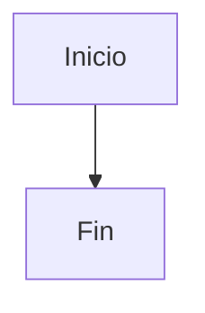
````

Errores habituales:

| Error | Causa | Solución |
|---|---|---|
| `No diagram type detected` | La primera palabra está mal escrita, por ejemplo `lowchart` en vez de `flowchart` | Revisar la primera línea del diagrama |
| El gráfico aparece como texto | Falta `mermaid` después de las tres comillas invertidas | Usar ` ```mermaid ` |
| El diagrama se rompe con textos largos | Algunos símbolos o palabras confunden al parser | Poner las etiquetas entre comillas dobles |
| Funciona en Mermaid Live Editor pero no en GitHub | GitHub puede usar una versión concreta de Mermaid | Probar con sintaxis sencilla o comprobar la versión |

Para comprobar qué versión de Mermaid está usando GitHub en ese momento, se puede crear un bloque con:

````markdown
```mermaid
info
```
````

Recomendación práctica para clase: pedir siempre a NotebookLM o al asistente que genere “Mermaid compatible con GitHub, sin estilos avanzados, sin directivas `init` y con etiquetas entre comillas”.

---

## 3. Flujo recomendado de uso con NotebookLM y GitHub

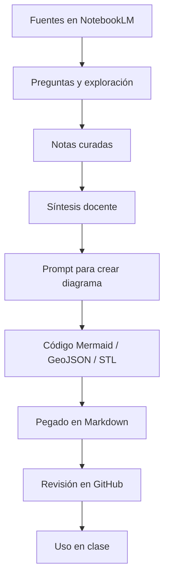

Este flujo ayuda a separar tres tareas: primero investigar con fuentes, después sintetizar conocimiento y finalmente convertir esa síntesis en un material visual.

---

## 4. Prompts generales para generar gráficos desde NotebookLM

### Prompt base para Mermaid compatible con GitHub

```text
A partir de las fuentes y notas activas, crea un diagrama Mermaid compatible con GitHub.
Usa sintaxis sencilla, sin estilos avanzados, sin directivas init y con las etiquetas entre comillas dobles.
El diagrama debe servir para explicar [TEMA] a estudiantes de [NIVEL].
Después del bloque Mermaid, explica brevemente cómo debería usarse en clase.
```

### Prompt para convertir una nota en gráfico

```text
Convierte esta nota en un diagrama Mermaid compatible con GitHub.
No añadas información que no esté en la nota.
Representa solo los conceptos, relaciones y consecuencias principales.
Usa etiquetas breves y claras.
```

### Prompt para revisar un gráfico

```text
Revisa este código Mermaid pensando en GitHub.
Detecta errores de sintaxis, etiquetas demasiado largas, nodos confusos o relaciones ambiguas.
Devuélveme una versión corregida y más clara.
```

---

# 5. Ejemplos Mermaid para docencia

## 5.1. Diagrama de flujo: procedimiento de investigación

**Cuándo usarlo:** para explicar una práctica, una metodología, una toma de decisiones o una secuencia de trabajo.

**Ejemplo aplicado al taller de AVM y Zillow:**

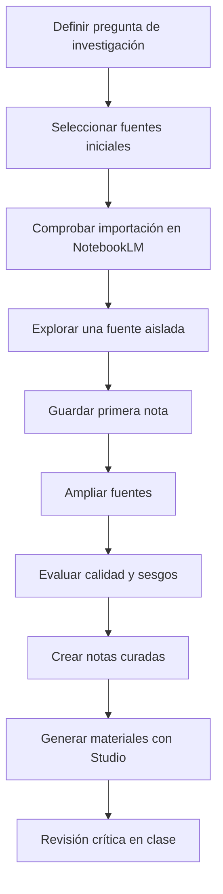

**Actividad docente:** pedir al alumnado que modifique el flujo para otro caso: sanidad, educación, finanzas, justicia algorítmica, vivienda pública o energía.

---

## 5.2. Diagrama de secuencia: interacción entre estudiante, NotebookLM y fuentes

**Cuándo usarlo:** para explicar interacciones, procesos conversacionales, protocolos, validaciones o dependencias entre actores.

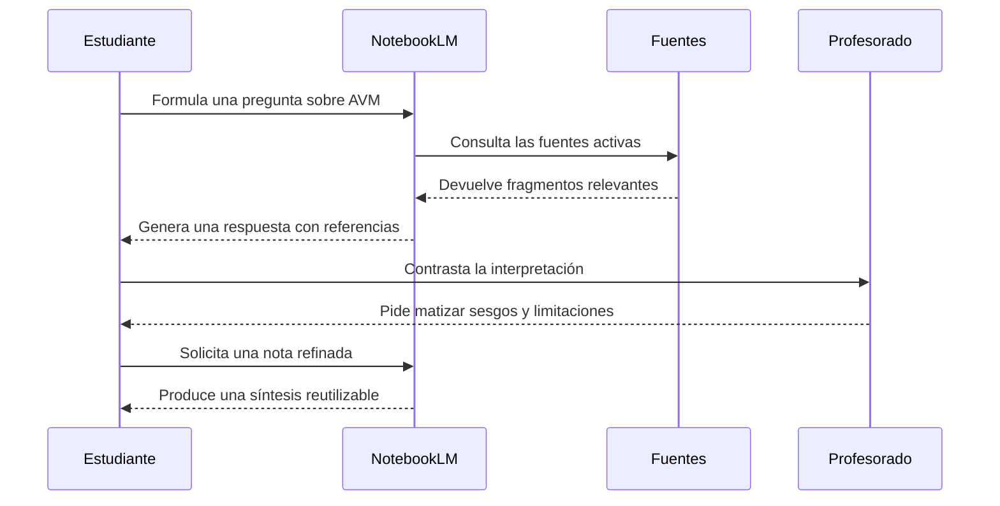

**Actividad docente:** usarlo para que el alumnado identifique dónde pueden aparecer errores: fuentes incompletas, malas preguntas, exceso de confianza o falta de verificación.

---

## 5.3. Timeline: evolución histórica de un caso

**Cuándo usarlo:** para explicar historia de una tecnología, evolución normativa, fases de un caso empresarial o desarrollo de una controversia.

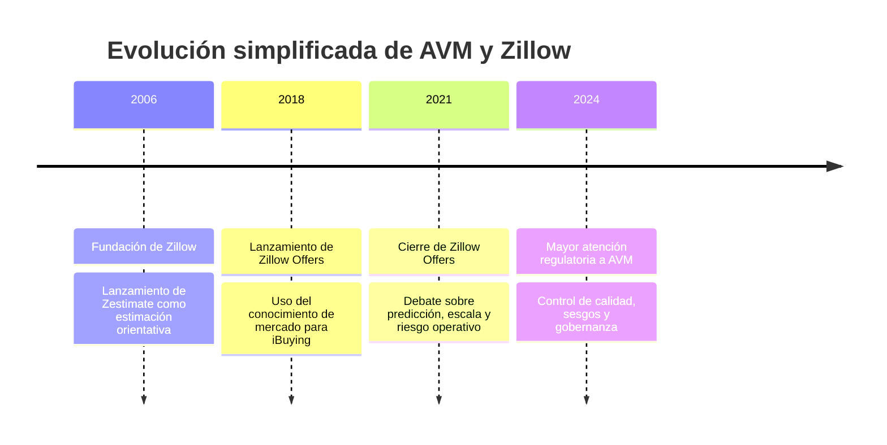

**Actividad docente:** pedir que la clase añada hitos extra a partir de fuentes verificadas y distinga entre hechos, interpretaciones y consecuencias.

---

## 5.4. User journey: experiencia del estudiante durante la práctica

**Cuándo usarlo:** para visualizar la experiencia de aprendizaje, detectar momentos de dificultad o diseñar una sesión práctica.

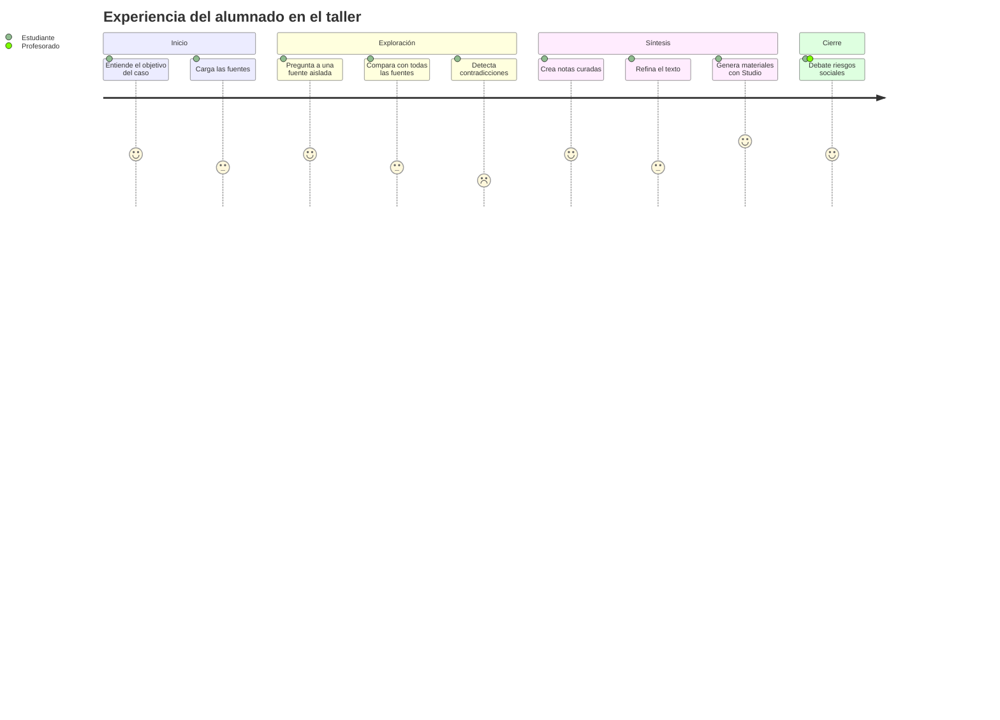

**Actividad docente:** pedir al alumnado que marque en qué punto se sintió más inseguro y qué tipo de apoyo necesitaría.

---

## 5.5. Gantt: planificación de una sesión práctica

**Cuándo usarlo:** para organizar talleres, trabajos por fases, cronogramas de proyectos o sesiones de laboratorio.

```mermaid
gantt
    title Taller NotebookLM: AVM y Zestimate
    dateFormat  HH:mm
    axisFormat  %H:%M

    section Preparación
    Presentación del caso                 :a1, 09:00, 15m
    Carga y comprobación de fuentes       :a2, after a1, 15m

    section Exploración
    Consulta con una fuente aislada       :b1, after a2, 20m
    Consulta con todas las fuentes        :b2, after b1, 20m
    Comparación de respuestas             :b3, after b2, 15m

    section Síntesis
    Creación de notas curadas             :c1, after b3, 25m
    Generación de materiales con Studio   :c2, after c1, 20m

    section Cierre
    Discusión crítica                     :d1, after c2, 20m
```

**Actividad docente:** convertirlo en una planificación realista para 90 minutos, 2 horas o una sesión doble.

---

## 5.6. Mindmap: mapa conceptual inicial

**Cuándo usarlo:** para introducir un tema, estructurar una lectura o resumir una unidad.

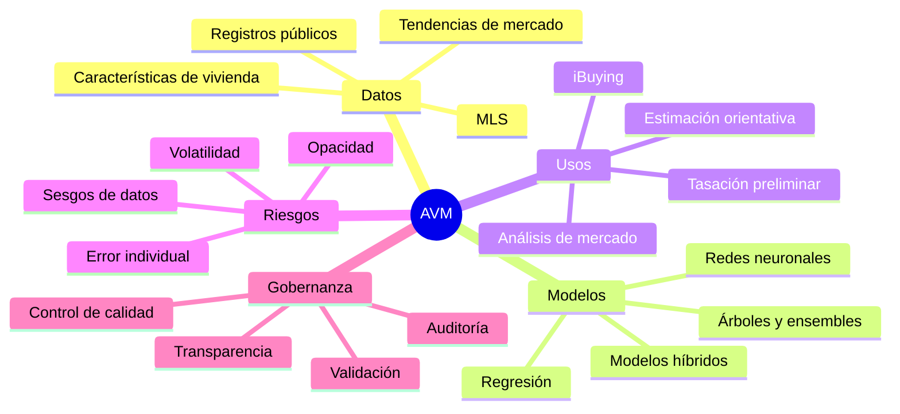

**Actividad docente:** pedir que cada grupo convierta una rama del mapa en una pregunta de investigación.

---

## 5.7. Quadrant chart: clasificar fuentes o tecnologías

**Cuándo usarlo:** para comparar fuentes, herramientas, modelos, riesgos o decisiones estratégicas en dos dimensiones.

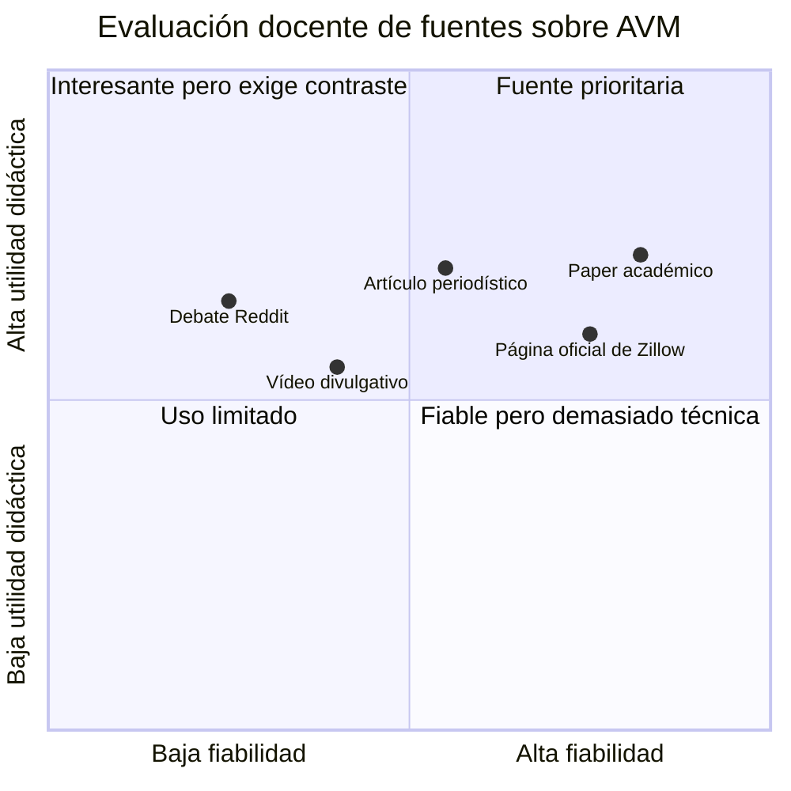

**Actividad docente:** discutir por qué “útil” no significa necesariamente “fiable”, y por qué una fuente fiable puede ser difícil de usar en clase.

---

## 5.8. Pie chart: composición aproximada de fuentes

**Cuándo usarlo:** para visualizar proporciones simples. No conviene usarlo para análisis complejos ni para comparar muchas categorías.

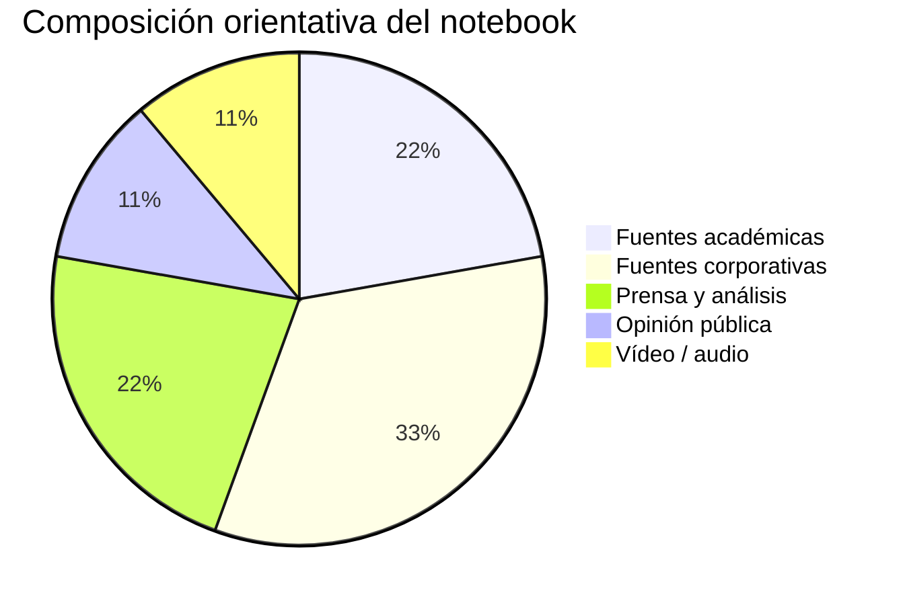

**Actividad docente:** pedir al alumnado que compare la composición de fuentes antes y después de usar “Descubrir”.

---

## 5.9. ER diagram: relación entre fuentes, notas y afirmaciones

**Cuándo usarlo:** para enseñar trazabilidad, estructura de datos, evidencias o construcción de conocimiento.

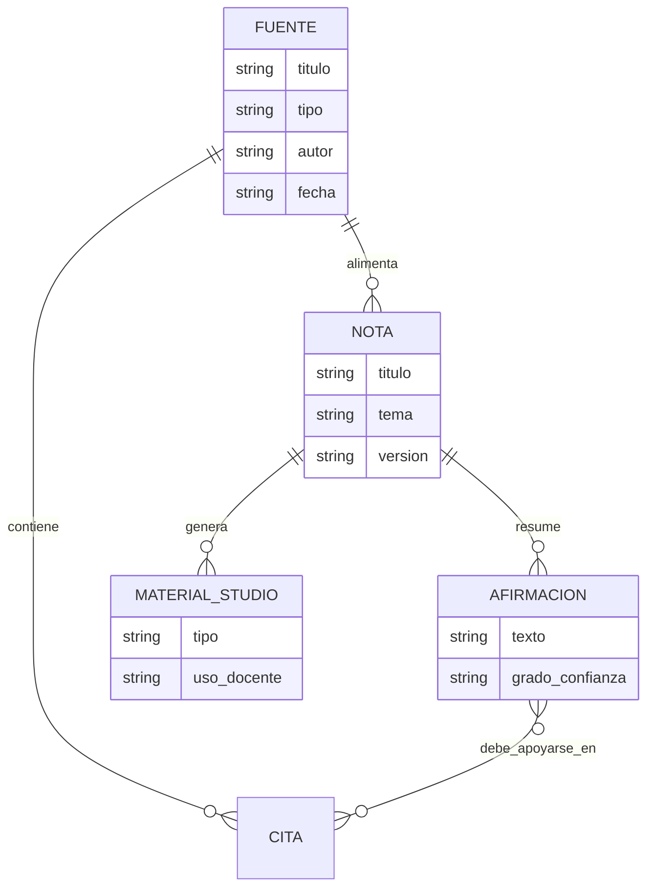

**Actividad docente:** útil para explicar que una respuesta generada no debería circular sin trazabilidad hacia las fuentes.

---

## 5.10. State diagram: ciclo de vida de una nota

**Cuándo usarlo:** para explicar estados, validaciones, revisión por pares o flujos de control.

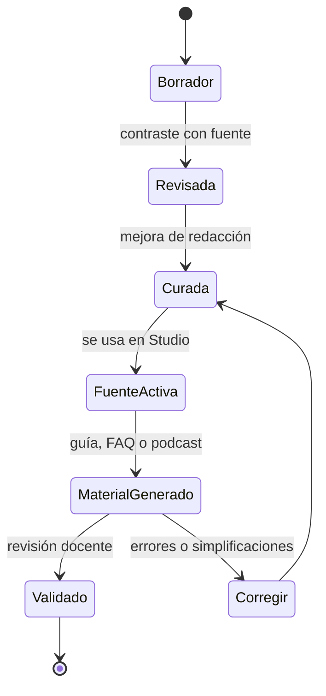

**Actividad docente:** pedir a cada grupo que documente qué nota está en qué estado y por qué.

---

## 5.11. Class diagram: componentes conceptuales de un AVM

**Cuándo usarlo:** para explicar componentes, propiedades y relaciones entre objetos o conceptos.

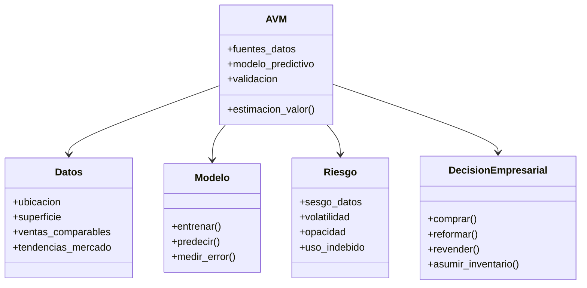

**Actividad docente:** debatir qué elementos pertenecen al modelo y cuáles pertenecen a la organización que lo usa.

---

## 5.12. GitGraph: iteración de materiales docentes

**Cuándo usarlo:** para explicar versionado, evolución de un proyecto o ramas de trabajo en una práctica colaborativa.

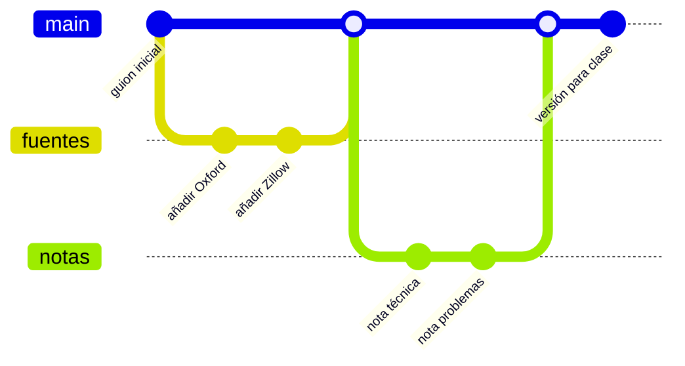

**Actividad docente:** usarlo para enseñar que el material docente generado con IA también debe tener versiones, revisiones y decisiones explícitas.

---

# 6. Otros gráficos soportados por GitHub

## 6.1. GeoJSON: mapas sencillos

**Cuándo usarlo:** para asignaturas con dimensión territorial: geografía, urbanismo, economía regional, mercado inmobiliario, medio ambiente, movilidad o políticas públicas.

Ejemplo: puntos relacionados con el caso AVM/Zillow y fuentes del taller.

```geojson
{
  "type": "FeatureCollection",
  "features": [
    {
      "type": "Feature",
      "properties": {
        "name": "Alicante",
        "description": "Lugar de la sesión o repositorio docente"
      },
      "geometry": {
        "type": "Point",
        "coordinates": [-0.4907, 38.3452]
      }
    },
    {
      "type": "Feature",
      "properties": {
        "name": "Oxford",
        "description": "Fuente académica sobre AVM"
      },
      "geometry": {
        "type": "Point",
        "coordinates": [-1.2577, 51.7520]
      }
    },
    {
      "type": "Feature",
      "properties": {
        "name": "Seattle",
        "description": "Sede histórica de Zillow"
      },
      "geometry": {
        "type": "Point",
        "coordinates": [-122.3321, 47.6062]
      }
    }
  ]
}
```

**Actividad docente:** pedir a NotebookLM una lista de lugares mencionados en las fuentes y convertirla en un mapa GeoJSON. Después, el alumnado debe comprobar coordenadas y relevancia.

**Prompt útil:**

```text
Extrae los lugares mencionados en las fuentes activas que sean relevantes para el caso.
Devuélvelos como una tabla con lugar, país, motivo de relevancia y coordenadas aproximadas.
No inventes coordenadas si no estás seguro; marca las dudosas para revisión manual.
```

---

## 6.2. TopoJSON: mapas avanzados y compactos

**Cuándo usarlo:** cuando ya se dispone de datos geográficos preparados, por ejemplo límites municipales, provincias, distritos censales o zonas de mercado.

En docencia general, TopoJSON suele ser menos adecuado para crear manualmente. Es mejor generarlo con herramientas externas y pegarlo en GitHub solo cuando el profesorado ya tiene el archivo.

Estructura mínima orientativa:

````markdown
```topojson
{
  "type": "Topology",
  "objects": {},
  "arcs": []
}
```
````

**Actividad docente:** comparar GeoJSON y TopoJSON: GeoJSON es más legible para principiantes; TopoJSON es más eficiente para geometrías complejas.

---

## 6.3. STL ASCII: modelos 3D simples

**Cuándo usarlo:** ingeniería, fabricación digital, arquitectura, diseño industrial, geometría, robótica o materiales.

Ejemplo mínimo de una pieza triangular:

```stl
solid triangulo_simple
  facet normal 0 0 1
    outer loop
      vertex 0 0 0
      vertex 1 0 0
      vertex 0 1 0
    endloop
  endfacet
endsolid triangulo_simple
```

**Actividad docente:** usarlo para mostrar cómo un objeto 3D puede documentarse como texto, versionarse y revisarse en un repositorio.

---

# 7. Actividades rápidas para profesorado

## Actividad A: de resumen textual a diagrama

1. El profesorado selecciona una nota generada en NotebookLM.
2. Pide un diagrama Mermaid de tipo `flowchart`, `mindmap` o `timeline`.
3. Lo pega en GitHub.
4. El alumnado revisa si el diagrama omite matices importantes.

**Prompt:**

```text
Convierte esta nota en tres versiones de diagrama Mermaid:
1. Un flowchart para explicar el proceso.
2. Un mindmap para introducir los conceptos.
3. Un timeline si hay evolución temporal.
Usa sintaxis compatible con GitHub y etiquetas breves.
```

## Actividad B: detectar sesgos mediante un quadrant chart

1. Cada grupo evalúa las fuentes del notebook.
2. Sitúa cada fuente en dos ejes: fiabilidad y utilidad didáctica.
3. Compara su gráfico con el de otros grupos.
4. Discute por qué no todos los grupos han clasificado igual las fuentes.

**Prompt:**

```text
Crea un quadrantChart Mermaid para clasificar estas fuentes según dos ejes:
fiabilidad y utilidad didáctica.
No conviertas automáticamente una fuente popular en fiable.
Justifica después cada posición en una frase.
```

## Actividad C: revisión crítica del audio o podcast

1. Se genera un audio o guion desde NotebookLM.
2. Se pide un diagrama de secuencia o journey sobre el argumento del audio.
3. La clase comprueba si el audio simplifica demasiado alguna relación causal.

**Prompt:**

```text
A partir del guion del podcast, crea un diagrama de secuencia Mermaid que muestre
cómo se construye el argumento: contexto, problema, causas, consecuencias y debate final.
Marca claramente qué afirmaciones son hechos y cuáles son interpretaciones.
```

---

# 8. Rúbrica para evaluar gráficos generados con IA

| Criterio | Excelente | A mejorar |
|---|---|---|
| Claridad | El gráfico se entiende sin explicación larga | Requiere demasiada explicación oral |
| Fidelidad a las fuentes | No añade afirmaciones no justificadas | Mezcla hechos, inferencias y opiniones |
| Utilidad docente | Ayuda a discutir o aprender un concepto | Es decorativo pero no aporta comprensión |
| Simplicidad | Usa pocos nodos y relaciones significativas | Incluye demasiada información |
| Compatibilidad | Renderiza correctamente en GitHub | Se rompe o depende de sintaxis avanzada |
| Revisión crítica | Invita a verificar y debatir | Presenta la salida como verdad cerrada |

---

# 9. Checklist antes de publicar en GitHub

- [ ] El bloque empieza con ` ```mermaid `, ` ```geojson `, ` ```topojson ` o ` ```stl `.
- [ ] La primera línea del diagrama Mermaid contiene un tipo válido: `flowchart`, `sequenceDiagram`, `timeline`, `journey`, `gantt`, `mindmap`, `pie`, `erDiagram`, `stateDiagram-v2`, `classDiagram`, `quadrantChart` o `gitGraph`.
- [ ] Las etiquetas largas están entre comillas dobles.
- [ ] No hay estilos avanzados innecesarios.
- [ ] El gráfico se ha probado en GitHub o en Mermaid Live Editor.
- [ ] El contenido no introduce afirmaciones que no estén en las fuentes.
- [ ] El profesorado ha revisado la interpretación antes de usarlo en clase.

---

# 10. Recomendación final

Para una primera experiencia docente, conviene empezar con tres tipos de gráfico:

1. **Flowchart**, para explicar procedimientos.
2. **Mindmap**, para introducir conceptos.
3. **Timeline**, para estudiar casos históricos o evolución de tecnologías.

Después se pueden añadir diagramas más analíticos:

- **Sequence diagram**, para interacciones entre actores.
- **Quadrant chart**, para clasificar fuentes, riesgos o decisiones.
- **ER diagram**, para enseñar trazabilidad entre fuentes, notas y afirmaciones.

La clave no es generar gráficos bonitos, sino convertirlos en objetos de discusión: qué resumen hacen, qué simplifican, qué ocultan y qué evidencias deberían sostenerlos.
