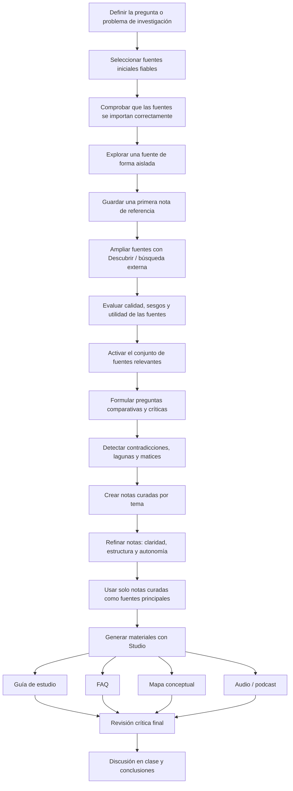

# Uso de modelos de valoración automatizada (AVM) en el sector inmobiliario con NotebookLM

## Objetivos de la práctica

En esta sesión práctica exploraremos el funcionamiento, las posibilidades y las limitaciones de los Modelos de Valoración Automatizada (_Automated Valuation Models_, AVM) en el sector inmobiliario. La práctica utilizará como caso de estudio el modelo **Zestimate** de Zillow y el cierre de **Zillow Offers**, la unidad de compraventa directa de viviendas de la compañía.

El objetivo no es decidir si “la IA acertó o falló” de forma simplista, sino analizar cómo se relacionan los modelos predictivos, la calidad de los datos, las condiciones de mercado, las decisiones empresariales y las consecuencias sociales del uso de algoritmos en contextos económicos de alto impacto.

Al finalizar la práctica, el alumnado debería ser capaz de:

- Explicar de forma conceptual qué es un AVM y qué tipo de datos utiliza.
- Diferenciar entre una estimación orientativa de valor y una tasación profesional.
- Comprender el papel de Zestimate dentro de Zillow y distinguirlo del modelo de negocio de Zillow Offers.
- Identificar limitaciones técnicas, operativas, financieras y sociales asociadas al uso de AVM.
- Utilizar NotebookLM para recopilar, comparar, sintetizar y transformar fuentes documentales.
- Evaluar críticamente las respuestas generadas por una herramienta de IA a partir de fuentes seleccionadas.

## Contexto: el caso de Zillow, Zestimate y Zillow Offers

Fundada en 2006, Zillow se consolidó como una de las plataformas inmobiliarias online más relevantes de Estados Unidos. Su algoritmo de valoración, **Zestimate**, se convirtió en una referencia pública para estimar el valor de mercado de viviendas. Zillow lo presenta como una estimación automatizada basada en datos disponibles, pero no como una tasación profesional.

En 2018, Zillow lanzó **Zillow Offers**, una línea de negocio de _iBuying_ dedicada a comprar viviendas directamente, reformarlas y revenderlas. Esta iniciativa requería algo más exigente que estimar el valor actual de una vivienda: exigía anticipar su valor futuro, gestionar reformas, costes de mantenimiento, tiempos de venta, inventario y riesgo de mercado.

En noviembre de 2021, Zillow anunció el cierre progresivo de Zillow Offers tras registrar fuertes pérdidas en su segmento de compraventa de viviendas. En el tercer trimestre de 2021, la compañía comunicó una pérdida antes de impuestos de aproximadamente 422 millones de dólares en el segmento Homes y un ajuste de inventario de unos 304 millones de dólares por haber comprado viviendas a precios superiores a sus estimaciones revisadas de venta futura.

Este caso permite discutir una idea central: un modelo puede ser útil como referencia informativa para usuarios, pero resultar insuficiente o arriesgado cuando se integra en una estrategia empresarial automatizada, con gran volumen de operaciones, márgenes estrechos y exposición directa a la volatilidad del mercado.

## Fase 0: comprobación previa de la herramienta y de las fuentes

Antes de comenzar con el análisis, conviene dedicar unos minutos a verificar que las fuentes se incorporan correctamente a NotebookLM y a conocer las limitaciones de la herramienta.

### 0.1. Comprobación técnica inicial

NotebookLM permite crear un cuaderno de trabajo a partir de fuentes como PDFs, páginas web, texto copiado, documentos de Google, audios o vídeos de YouTube con transcripción. Sin embargo, la herramienta no interpreta necesariamente todo lo que aparece en una página: en las fuentes web suele importar el texto principal disponible, no todos los elementos visuales, vídeos incrustados o páginas enlazadas. En YouTube, el contenido útil dependerá de que exista una transcripción accesible.

**Acción:**

1. Crea un nuevo cuaderno en NotebookLM.
2. Añade una fuente PDF, una fuente web y una fuente de YouTube.
3. Comprueba que cada fuente se ha importado correctamente.
4. Revisa si NotebookLM genera un resumen de cada fuente y qué temas clave identifica.
5. Anota cualquier problema de importación o ausencia de contenido relevante.

## Fase 1: recopilación y exploración inicial de fuentes

### 1.1. Configuración inicial: documentos y fuentes web

Comenzaremos cargando un conjunto de documentos y enlaces web que servirán como base para la investigación.

### Documentos y fuentes fundamentales

**Explicación del funcionamiento del modelo Zestimate:**

- Imputación de datos para Zestimate: `https://www.zillow.com/tech/imputing-data-for-the-zestimate/`
- Construcción del Zestimate neuronal: `https://www.zillow.com/tech/building-the-neural-zestimate/`
- Página oficial de Zillow sobre Zestimate y su precisión: `https://www.zillow.com/zestimate/`

**Investigación académica sobre AVM:**

- University of Oxford Research. _The future of automated real estate valuations (AVMs)_: `https://www.sbs.ox.ac.uk/sites/default/files/2022-03/FoRE%20AVM%202022.pdf`

**Caso Zillow Offers y análisis empresarial:**

- Análisis del cierre de Zillow Offers (JISE): `https://jise.org/Volume35/n1/JISE2024v35n1pp67-72.pdf`
- Artículo de CNN sobre la debacle de Zillow: `https://edition.cnn.com/2021/11/09/tech/zillow-ibuying-home-zestimate`
- Resultados financieros de Zillow Q3 2021 y cierre de Zillow Offers: `https://investors.zillowgroup.com/investors/news-and-events/news/news-details/2021/Zillow-Group-Reports-Third-Quarter-2021-Financial-Results--Shares-Plan-to-Wind-Down-Zillow-Offers-Operations/default.aspx`
- Carta a accionistas Q3 2021: `https://s24.q4cdn.com/723050407/files/doc_financials/2021/q3/Zillow-Group-Q3%2721-Shareholder-Letter.pdf`

**Percepción pública y debate social:**

- Debate en Reddit sobre la precisión de Zestimate: `https://www.reddit.com/r/FirstTimeHomeBuyer/comments/1e34ygc/how_accurate_are_zillow_zestimates/`
- Vídeo de YouTube sobre el caso: `https://www.youtube.com/watch?v=TTDR8gB957E`

**Regulación, calidad y riesgos de los AVM:**

- FDIC: norma final sobre estándares de control de calidad para AVM: `https://www.fdic.gov/news/financial-institution-letters/2024/final-rule-real-estate-valuations-quality-control-standards`
- Federal Register: _Quality Control Standards for Automated Valuation Models_: `https://www.federalregister.gov/documents/2024/08/07/2024-16197/quality-control-standards-for-automated-valuation-models`

**Acción:**

1. Descarga los ficheros PDF de los enlaces proporcionados cuando sea necesario.
2. En un nuevo cuaderno de NotebookLM, añade los PDFs como fuentes.
3. Añade también las URLs restantes como fuentes web o fuentes de YouTube.
4. Renombra las fuentes con títulos claros y homogéneos. Por ejemplo: `Oxford - Future of AVM`, `Zillow - Zestimate Accuracy`, `JISE - Zillow Offers Case`, `FDIC - AVM Quality Control`.

### 1.2. Primera consulta con una única fuente

Ahora realizaremos una primera consulta utilizando solo una fuente para entender cómo condiciona la respuesta el corpus documental disponible.

**Acción:**

1. Selecciona como única fuente el documento `University of Oxford Research. The future of automated real estate valuations (AVMs).pdf`.
2. Realiza la siguiente pregunta al cuaderno:

```text
Háblame sobre el uso de modelos de valoración automatizada (AVM) en el sector inmobiliario. Explica como ejemplo de uso el Zestimate y valora si puede considerarse un modelo útil, teniendo en cuenta sus límites y el contexto de aplicación.
```

3. Guarda la respuesta generada por NotebookLM como una nueva **Nota** titulada `Introducción AVM y Zestimate (Oxford)`.
4. Anota en una frase qué aspectos de la respuesta dependen claramente de la fuente usada.

## Fase 2: ampliación, evaluación y profundización con NotebookLM

### 2.1. Uso de la herramienta Descubrir

La herramienta **Buscar nuevas fuentes en la web / Busqueda profunda** permite ampliar la base de conocimiento sugiriendo fuentes adicionales relevantes. En este paso no asumiremos que todas las sugerencias son de calidad suficiente; las trataremos como candidatas que deben ser evaluadas.

**Acción:**

1. Utiliza la función _Buscar nuevas fuentes en la web_ con los siguientes prompts, uno a la vez:

```text
Uso de los Modelos de Valoración Automatizada (AVM) en el sector inmobiliario.
```

```text
Quiero conocer más sobre el modelo de valoración automatizada de Zillow, Zestimate, si existen algoritmos similares y hasta qué punto estas tecnologías permiten estimar precios de vivienda de forma automática, fiable y socialmente aceptable.
```

2. Revisa las fuentes sugeridas por _Buscar nuevas fuentes en la web_.
3. Añade solo aquellas que parezcan pertinentes, actuales y suficientemente fiables.
4. Vuelve a activar todas las fuentes iniciales y las añadidas mediante la busqueda.
5. Realiza de nuevo la pregunta del punto 1.2:

```text
Háblame sobre el uso de modelos de valoración automatizada (AVM) en el sector inmobiliario. Explica como ejemplo de uso el Zestimate y valora si puede considerarse un modelo útil, teniendo en cuenta sus límites y el contexto de aplicación.
```

6. Compara esta respuesta con la obtenida usando solo la fuente de Oxford.
7. Guarda la nueva respuesta en una **Nota** titulada `Visión ampliada AVM y Zestimate`.

### 2.2. Evaluación de calidad de las fuentes

Antes de seguir generando notas, elaboraremos una matriz de calidad de fuentes. Esto ayuda a diferenciar fuentes académicas, fuentes corporativas, prensa, documentación regulatoria y opiniones de usuarios.

**Acción:**

Con todas las fuentes relevantes activas, utiliza el siguiente prompt:

```text
Crea una tabla con todas las fuentes activas. Para cada una indica: tipo de fuente, autor o entidad responsable, fecha aproximada, tesis principal, datos clave, posibles sesgos, limitaciones, utilidad para analizar el caso Zillow Offers y si debe usarse como fuente principal, secundaria o solo contextual.
```

Guarda la respuesta como una **Nota** titulada `Matriz de calidad de fuentes AVM`.

**A tener en cuenta:**

Una fuente corporativa puede ser muy útil para conocer cómo una empresa explica su propio modelo, pero también puede presentar sesgos reputacionales. Una conversación en Reddit puede ser útil para analizar percepciones, pero no debe tratarse como evidencia estadística sobre la precisión real del modelo.

### 2.3. Detección de contradicciones y tensiones entre fuentes

Una parte importante del trabajo con NotebookLM es detectar cuándo las fuentes no dicen exactamente lo mismo o enfatizan aspectos distintos.

**Acción:**

Con todas las fuentes activas, utiliza el siguiente prompt:

```text
Identifica afirmaciones en las que las fuentes no estén de acuerdo o enfaticen aspectos distintos. Para cada desacuerdo, indica qué fuente sostiene cada postura, qué evidencia aporta y qué conclusión prudente puede extraerse. No fuerces una síntesis si las fuentes no permiten resolver el conflicto.
```

Guarda la respuesta como una **Nota** titulada `Contradicciones y tensiones entre fuentes AVM`.

## Fase 3: creación de notas analíticas a partir de fuentes específicas

NotebookLM permite interactuar con cada fuente, mostrar resúmenes y detectar temas clave. En esta fase generaremos notas consolidadas a partir de documentos específicos para facilitar su uso posterior.

### 3.1. Resumen del informe de Oxford

**Acción:**

1. Selecciona como única fuente el PDF `University of Oxford Research. The future of automated real estate valuations (AVMs).pdf`.
2. Pide a NotebookLM un resumen con el siguiente prompt:

```text
Crea un resumen extenso del documento. El resumen debe evaluar los temas clave, las relaciones entre conceptos, los usos actuales y potenciales de los AVM, sus beneficios, sus limitaciones y los riesgos asociados. El resultado se utilizará posteriormente como fuente de trabajo, por lo que debe ser claro, completo y autocontenido.
```

3. Guarda el resumen como una **Nota** titulada `Resumen extenso - Oxford AVM Future`.
4. Para fases posteriores, desactiva el PDF original y activa esta nota cuando quieras trabajar de forma más ágil. No elimines la fuente original, porque puede ser necesaria para verificar afirmaciones.

### 3.2. Resumen del caso Zillow Offers según JISE

**Acción:**

1. Selecciona como única fuente el PDF `Teaching Case: When Strength Turns Into Weakness... Zillow Offers.pdf`.
2. Pide a NotebookLM un resumen con el siguiente prompt:

```text
Resume el texto explicando las características de Zestimate, sus posibles fallos y las circunstancias que rodearon al fracaso de Zillow Offers. Diferencia claramente entre causas imputables al algoritmo o a la predicción, causas imputables a la empresa, causas operativas, causas financieras y causas derivadas del mercado inmobiliario.
```

3. Guarda el resumen como una **Nota** titulada `Análisis fallo Zillow Offers (JISE)`.
4. Desactiva el PDF original y activa esta nota en las fases de síntesis, conservando siempre el PDF como fuente verificable.

### 3.3. Análisis de percepción pública a partir de Reddit

**Acción:**

1. Selecciona como única fuente el enlace de Reddit.
2. Realiza la siguiente pregunta:

```text
Analiza esta conversación como evidencia de percepción pública. Diferencia entre experiencias personales, opiniones, afirmaciones verificables y posibles sesgos de muestra. Explica cómo perciben los usuarios el algoritmo Zestimate, qué problemas mencionan y qué expectativas tienen sobre la valoración automática. No uses Reddit como prueba estadística de la precisión real del modelo.
```

3. Guarda la respuesta como una **Nota** titulada `Percepción pública Zestimate (Reddit)`.

### 3.4. Resumen técnico de algoritmos AVM

**Acción:**

1. Activa las fuentes más técnicas. Por ejemplo: los artículos técnicos de Zillow, la página oficial de Zestimate y la nota del informe de Oxford.
2. Pide a NotebookLM un resumen técnico con el siguiente prompt:

```text
Necesito un resumen TÉCNICO de los algoritmos usados para AVM. Separa las técnicas según su calidad, madurez, novedad y dependencia de datos. Incluye modelos estadísticos tradicionales, enfoques hedónicos, métodos de machine learning, modelos neuronales, imputación de datos, uso de variables espaciales y limitaciones asociadas a datos incompletos o sesgados. El resumen solo debe detallar características técnicas, sin entradilla ni conclusión final. Si hay que referenciar fuentes, inclúyelas al final en una tabla con el nombre de la fuente y la aportación técnica concreta.
```

3. Guarda la respuesta como una **Nota** titulada `Resumen técnico algoritmos AVM`.

### 3.5. Problemas, consecuencias sociales y usos de los AVM

**Acción:**

1. Activa las fuentes que traten riesgos, impacto social, regulación y consecuencias del uso de AVM. Por ejemplo: CNN, JISE, Reddit, Oxford, FDIC y Federal Register.
2. Pide a NotebookLM un resumen con el siguiente prompt:

```text
Crea un resumen sobre los problemas detectados con los modelos de valoración automática de viviendas. Distingue problemas técnicos, problemas de datos, problemas de equidad, problemas de transparencia, problemas de uso empresarial, problemas regulatorios y consecuencias sociales. Explica qué daños o efectos pueden producirse en consumidores, empresas, entidades financieras y mercados inmobiliarios. Cita las fuentes en un apartado final en formato tabla, pero sin indicar números de línea.
```

3. Guarda la respuesta como una **Nota** titulada `Problemas y consecuencias AVM`.

### 3.6. Diferencia entre Zestimate y Zillow Offers

Esta actividad es clave para evitar una conclusión demasiado simplista sobre el caso.

**Acción:**

Activa las fuentes sobre Zestimate, Zillow Offers, resultados financieros y análisis externo. Utiliza el siguiente prompt:

```text
Explica la diferencia entre Zestimate como estimación automatizada del valor de una vivienda y Zillow Offers como modelo de negocio de iBuying. Indica por qué un modelo puede ser razonablemente útil como referencia informativa para consumidores, pero insuficiente para comprar, reformar y revender viviendas a gran escala. Separa la explicación en cuatro dimensiones: predicción, operación, finanzas y riesgo de mercado.
```

Guarda la respuesta como una **Nota** titulada `Diferencia Zestimate y Zillow Offers`.

## Fase 4: refinamiento de notas y creación de una nota maestra

### 4.1. Refinamiento de notas

Las notas generadas pueden pulirse para convertirlas en textos autónomos y bien redactados.

**Acción:**

1. Selecciona una de las notas creadas, por ejemplo `Problemas y consecuencias AVM`.
2. Utiliza el siguiente prompt para refinarla:

```text
Transforma este resumen. No utilices bullets ni listados con puntos o apartados. Redacta el texto de manera más legible y literaria, manteniendo una estructura lógica de hecho, explicación y consecuencia. Elimina las citas del cuerpo del texto para que se pueda guardar como una nota independiente y autocontenida. Mantén al final una breve tabla de fuentes utilizadas.
```

3. Guarda la versión refinada con un nuevo nombre, por ejemplo `Problemas y consecuencias AVM - Refinado`.
4. Repite este proceso con otras notas si lo consideras necesario.

**Comentario docente:**

Si NotebookLM no permite editar directamente una nota guardada automáticamente, copia el contenido en una nota manual o en un documento externo y usa la versión refinada como nueva fuente de trabajo.

### 4.2. Creación de una nota maestra

Antes de usar Studio para generar materiales finales, construiremos una nota maestra que funcione como síntesis curada del taller.

**Acción:**

Activa únicamente las notas ya creadas y refinadas. Después utiliza el siguiente prompt:

```text
A partir de las notas curadas, crea una nota maestra titulada "Síntesis crítica AVM y Zillow Offers".

Debe tener cinco apartados:
1. Qué es un AVM y para qué sirve.
2. Cómo funciona conceptualmente Zestimate.
3. Qué diferencias hay entre estimar un precio y operar un negocio iBuying.
4. Qué falló en Zillow Offers: factores técnicos, operativos, financieros y de mercado.
5. Qué riesgos sociales, éticos y regulatorios plantean los AVM.

Incluye al final una tabla de fuentes usadas, indicando para cada una qué aportación concreta ha hecho. Evita afirmaciones tajantes si las fuentes no permiten sostenerlas con claridad.
```

Guarda la respuesta como una **Nota** titulada `Síntesis crítica AVM y Zillow Offers`.

## Fase 5: uso de Studio para síntesis y materiales de estudio

La funcionalidad **Studio** de NotebookLM permite generar materiales de estudio a partir de fuentes y notas ya curadas. En esta fase es importante no activar indiscriminadamente todas las fuentes originales, sino trabajar con el corpus que el alumnado ha depurado.

### 5.1. Preparación de fuentes para Studio

**Acción:**

1. Desactiva todas las fuentes originales: PDFs, URLs, vídeos y fuentes web.
2. Activa únicamente las notas curadas y refinadas.
3. Asegúrate de que la nota `Síntesis crítica AVM y Zillow Offers` está activada.

### 5.2. Generación de materiales

Utiliza Studio para generar:

- Una **Guía de estudio** sobre AVM y el caso Zestimate.
- Una lista de **Preguntas frecuentes (FAQ)**.
- Un **Mapa conceptual** que relacione AVM, Zestimate, Zillow Offers, riesgo, datos, regulación, usuarios y mercado.
- Si la herramienta lo permite, una **infografía** o una **presentación breve** para repasar el caso.

Después de generar cada material, revisa si simplifica en exceso la distinción entre Zestimate y Zillow Offers.

### 5.3. Creación de un audio resumen o podcast

Puedes utilizar la herramienta de audio de NotebookLM o pedir primero un guion. Si se genera un audio directamente, debe escucharse críticamente, porque los resúmenes de audio pueden omitir matices, exagerar relaciones causales o presentar como consenso lo que solo aparece en una fuente.

**Prompt para guion de audio:**

```text
Crea un guion para un audio podcast breve. El tema es sobre los algoritmos de valoración automática de viviendas (AVM). El guion debe incluir: una breve historia de los AVM, Zestimate como caso de estudio, sus fortalezas y debilidades, la diferencia entre Zestimate y Zillow Offers, y una discusión sobre sus consecuencias sociales, económicas y regulatorias.

El tono debe ser introductorio, para alumnos que no conocen el tema. Debe fomentar la discusión sobre utilidad social, riesgos de automatización, confianza, transparencia, sesgos y consecuencias a largo plazo.

El guion debe estar en español de España, con dos locutores: un hombre, que actúa como presentador y formula preguntas, y una mujer, que actúa como experta, responde y da contexto. La mujer también puede hacer una breve introducción inicial.
```

**Actividad de revisión del audio:**

Después de escuchar el audio, responde individualmente o en grupo:

1. ¿Qué aspectos del caso ha simplificado más el audio?
2. ¿Distingue correctamente entre Zestimate y Zillow Offers?
3. ¿Presenta opiniones como si fueran hechos?
4. ¿Qué idea importante de las fuentes no aparece?
5. ¿Qué pregunta de debate añadirías al final?

## Fase 6: entrega final y discusión en clase

### 6.1. Entrega final individual o por grupos

Cada estudiante o grupo entregará un breve informe de síntesis, de entre 800 y 1.200 palabras, basado en las notas y materiales generados.

El informe debe responder a la siguiente pregunta:

```text
¿Qué nos enseña el caso Zillow Offers sobre el uso de modelos de valoración automatizada en decisiones empresariales y sociales de alto impacto?
```

El texto debe incluir:

- Una explicación breve de qué es un AVM.
- Una explicación de Zestimate como ejemplo de AVM.
- Una distinción clara entre Zestimate y Zillow Offers.
- Al menos tres causas del fracaso de Zillow Offers, separando factores técnicos y no técnicos.
- Una reflexión sobre riesgos sociales, éticos o regulatorios.
- Una conclusión prudente sobre el futuro de los AVM.

### 6.2. Rúbrica orientativa

| Criterio                                               | Peso |
| ------------------------------------------------------ | ---: |
| Selección y justificación de fuentes                   |  20% |
| Uso correcto de evidencias y citas                     |  20% |
| Distinción entre fallo algorítmico y fallo empresarial |  25% |
| Análisis de riesgos sociales, éticos y regulatorios    |  20% |
| Claridad, estructura y calidad del producto final      |  15% |

### 6.3. Preguntas para la discusión en clase

- ¿Qué otros factores, además de los técnicos, influyeron en el caso Zillow Offers?
- ¿Por qué un modelo útil para orientar a consumidores puede ser peligroso si se usa para operar compras masivas de viviendas?
- ¿Cómo podrían mejorarse los AVM para ser más fiables, transparentes y justos?
- ¿Qué responsabilidades éticas tienen las empresas que desarrollan e implementan estos algoritmos?
- ¿Qué papel debería tener la regulación en el uso de AVM para hipotecas, tasaciones o decisiones inmobiliarias?
- ¿Qué diferencias hay entre automatizar una predicción y automatizar una decisión económica?
- ¿Cómo imagináis el futuro de la valoración inmobiliaria con IA?

## Cierre de la práctica

Al finalizar esta práctica, deberíamos tener una comprensión más profunda de la complejidad técnica y social de los AVM. El caso Zillow Offers muestra que los modelos predictivos no operan en el vacío: dependen de datos, supuestos, incentivos empresariales, procesos operativos, regulación y condiciones de mercado.

NotebookLM se utiliza aquí no solo como herramienta de resumen, sino como entorno para practicar investigación asistida por IA: seleccionar fuentes, comparar evidencias, detectar contradicciones, crear notas curadas y transformar conocimiento en materiales de estudio. La calidad del resultado dependerá menos de hacer una única “buena pregunta” y más de construir un corpus fiable, formular prompts precisos y revisar críticamente las respuestas generadas.

## Esquema de uso de notebookLM


